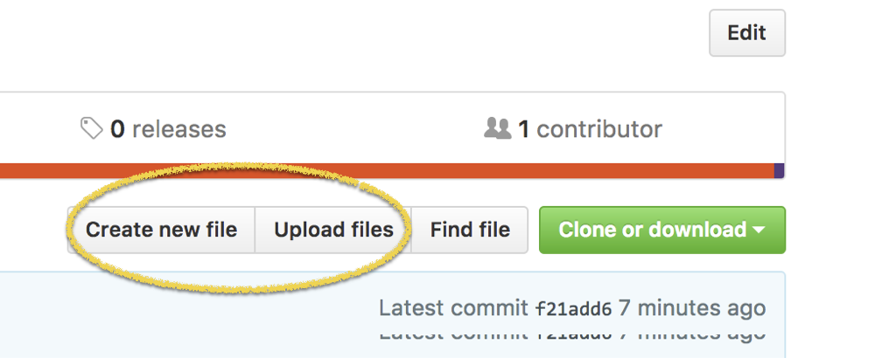

# Instructions

1. You can (but you don't have to) clone this repo to your local machine. 
2. Change the name of the file LastnameFirstname.Rmd to your first and last name.
3. Make sure to add the renamed .Rmd file back into the repo in case it disappeared.
**You can create a new file in a github repository by clicking on the `Create new file` or `Upload files` button.**

4. Write your blog post in the Rmd file.
5. Upload your work to this repository. 

